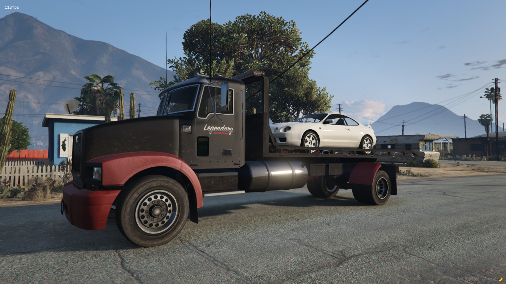

# Flatbed Script

## Description
* This script allows you to smoothly move the tow truck bed without any lag, providing a fluid and realistic experience.
* This is a basic script, which means **you can do whatever you want with it** !

## Dependencies
- [ox_lib](https://github.com/overextended/ox_lib/releases)
- [ox_target](https://github.com/overextended/ox_target/releases)

## Info
This script uses the following native function to move the bed [SetVehicleBulldozerArmPosition](https://docs.fivem.net/natives/?_0xF8EBCCC96ADB9FB7)

## Credits
- [MTL Flatbed](https://gta5-mods.com/vehicles/mtl-flatbed-tow-truck) by **ImNotMentaL** <3.
- [Maibatsu Mule Recovery](https://www.gta5-mods.com/vehicles/maibatsu-mule-recovery-add-on) by **TheF3nt0n** <3.

## Demo
[Watch the demo video](https://streamable.com/ttkngf)

## Support
If you encounter any issues or have suggestions for improvement, feel free to open an issue or contribute to the project.